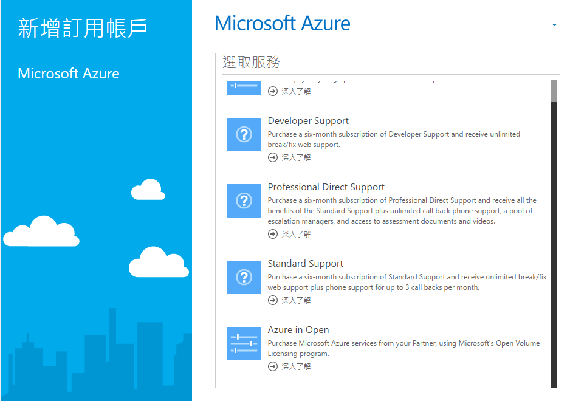

# Hands on Lab 0 - 準備工作 #

操作時間: **30 分鐘**

# 1. 申請 Azure 訂閱 #

## 一般免費試用 ##

在操作本教材前，必須先確認是否擁有 Microsoft Azure 的訂閱帳戶，若尚未申請，請參考 [Azure 食譜 - 1.1 建立 Microsoft Azure 訂閱帳戶](http://book.azure-recipes.tw/chapter01/01_signup.html) 上的文章申請免費試用 30 天（含新台幣 6,300 元額度）。

## 使用特殊訂閱服務開始 ##

若您欲採用其它方式購買 Microsoft Azure 的訂閱帳戶（如：**Azure in Open**），請使用 https://account.windowsazure.com/signup?showCatalog=True 這個連結，登入 Microsoft 帳號（以前稱作 MSN 帳號或 Windows Live ID）後選擇對應的服務購買。

# 2. 建立 Azure 儲存體帳戶 #

因為在操作 Azure IoT Suite 的相關 labs 中經常會用到 Azure Blob 儲存體，所以為了之後的操作方式便，可以先建立一個儲存體帳戶以便後續使用。

建立方式請參考 [Azure 食譜 - 4.1 建立儲存體帳號](http://book.azure-recipes.tw/chapter04/01_create_storage_account.html)。

# 3. 安裝軟體 #

操作過程中可能會使用到下列軟體：

  1. Visual Studio 2013 以上（**Community**, Professional, Premium, Ultimate 版本都可以）。
  2. Excel 2013 ProPlus 以上。
  3. [AzCopy](http://aka.ms/downloadazcopy) - 用來上傳檔案至 Azure 儲存體，詳見[使用說明](http://aka.ms/azcopy)。

# 4. 善用論壇 #

請多多利用 [MSDN 論壇 - Microsoft Azure PaaS 服務](https://social.msdn.microsoft.com/Forums/zh-TW/home?forum=2199) 的論壇來發問及交流。