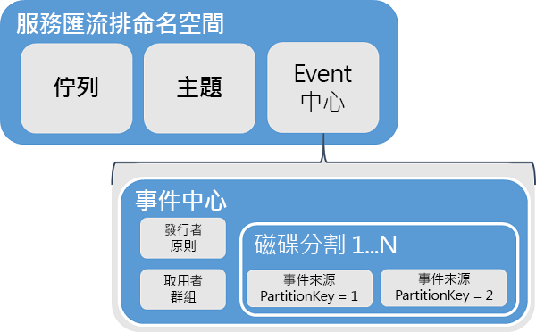
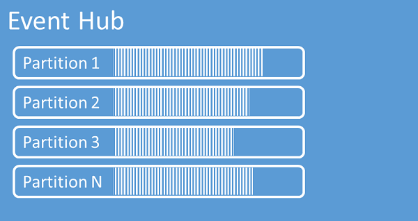
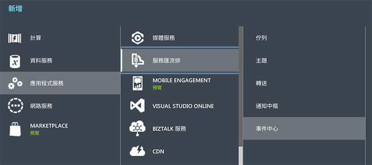
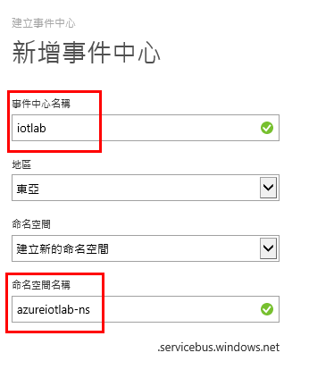
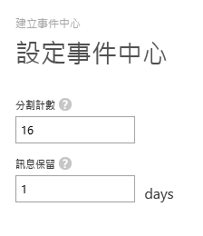
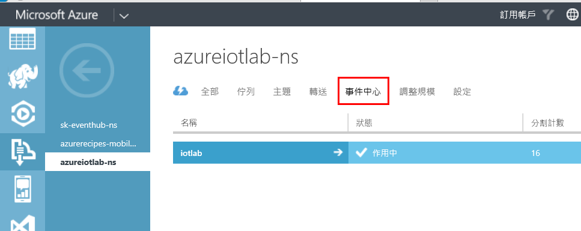
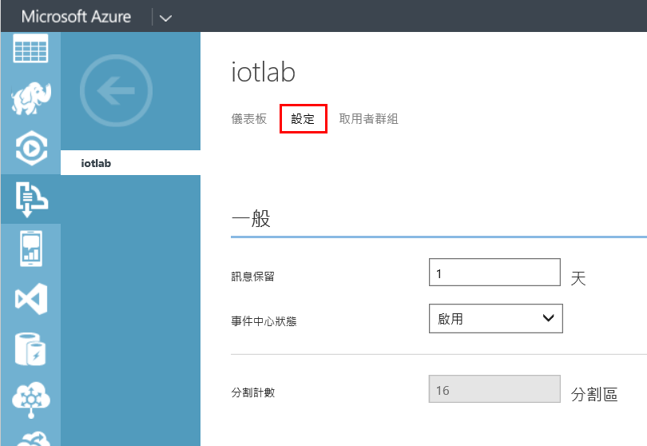
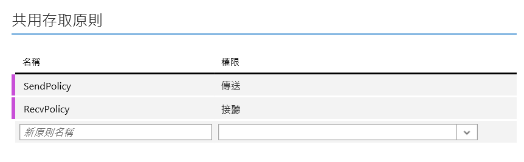
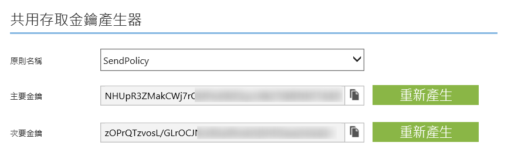

# Hands on Lab 1 - 使用 Azure Event Hubs #

操作時間：**30 分鐘**

事前準備：**擁有 Microsoft Azure 的訂閱帳戶並且能夠開通服務**。

# 1. Azure Event Hubs #

想像一種 IoT 情境 -- 你佈建了很多感測器，而它們不斷傳送大量的資料出來，如果讓這些感測器直接將資料寫入儲存體，I/O 寫入的速度可能追不上資料產生的速度，Event Hubs 就是為了能在短時間處理大量資料（如：每秒數百萬計）的佇列（queue）服務，它提供簡單的讀寫操作，而且通用的網路通訊協定（HTTP、AMQP），讓感測器可以很快地將資料先送到 Event Hubs 中（而且還不限前端 IoT 裝置使用何種技術平台），然後在時效之前將這些資料取出寫進（永久）儲存體中，這可以幫助開發人員節省力氣處理資料頻寬的問題。

## Event Hubs 的技術 ##

Event Hubs 是 [Azure Service Bus](http://azure.microsoft.com/zh-tw/services/service-bus/)（服務匯流排）中的一個特殊的佇列服務，連線與身份驗證的部份與 Service Bus 其它的服務一致，但是佇列結構有些不同，在 Event Hubs 中有**分割 (partition)** 的概念，這與 Event Hubs 能處理資料的頻寬有關，愈多的分割區就能提供更高的資料處理頻寬。你可以在 Event Hubs 中建立 8 ~ 32 個分割。

# 2. 建立 Event Hubs 服務

所需時間: **5 分鐘**

1.  在 [Microsoft Azure 的管理後台](https://manage.windowsazure.com/)，點擊左下角的_「+ 新增」_，選擇_「應用程式服務」_ » _「服務匯流排」_ » _「事件中心」_ ，選擇**自訂建立**。

    

2.  第一步，輸入 **事件中心名稱**，這個是 Event Hubs 的名字，之後使用程式介接時會用到這個名稱；資料中心的地區選擇 **東亞**，然後建立一個新的命名空間，這個是 Azure 服務匯流排（Service Bus）的名稱，必須取一個全球唯一的名稱，欄位後方會顯示該名稱是否可用。（Event Hubs 是服務匯流排裡的一個服務，所以服務的 URL 位址是以服務匯流排的 URL 為準）
    
    

3.  接著按下一步，設定 Event Hubs 的分割（partition）以及訊息要保留在 Event Hubs 裡多久，這裡我們設定_分割_為 **16**，_訊息保留_ **1** 天。

    

4.  最後，按下右下角的勾勾按鈕，完成建立。

# 3. 設定 Event Hubs 的存取原則

所需時間: **5 分鐘**

為了讓程式能接上 Event Hubs 來_傳送_或_接收_訊息，我們必須設定存取原則，讓程式使用不同的金鑰來傳送或接收（或是同時能傳也能收），做到權限的區分。

1.  在 [Microsoft Azure 的管理後台](https://manage.windowsazure.com/)，到剛才建立的服務匯流排中，切換到**事件中心**的頁面。

    

2.  進入建立好的 Event Hubs，切換到**設定**的頁面，你也可以在這頁修改訊息保留的時間。

    

3.  在 Event Hubs 的**設定**頁面下方的_「共用存取原則」_，新增兩個傳送訊息的原則，一個名稱為 **SendPolicy**，權限選擇**傳送**；另一個名稱為 **RecvPolicy**，權限選擇**接聽**。

	

4.  最後按下下方工作列的**儲存**按鈕，確定將新增的存取原則儲存。如果設定正確，你會在同一個頁面最下方看到_「共用存取金鑰產生器」_區域，這裡就可以取得不同原則的金鑰。

	

# 4. 傳送訊息到 Event Hubs

所需時間: **10 分鐘**

# 5. 從 Event Hubs 中取出訊息

所需時間: **10 分鐘**