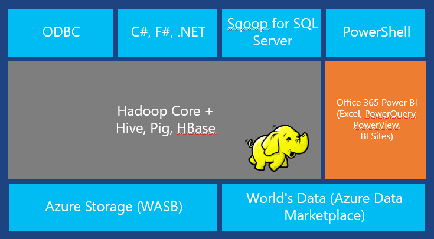
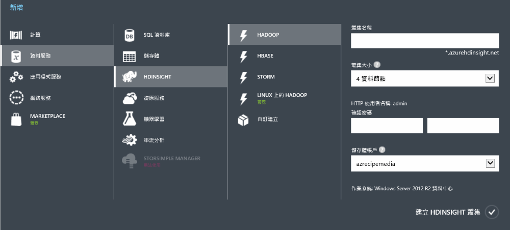
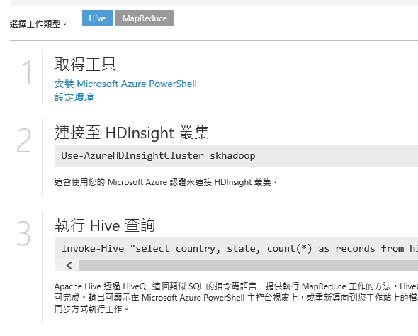

# Hands on Lab 3 - 使用 Azure HDInsight #

操作時間: **60 分鐘**

事前準備：

  1. **擁有 Microsoft Azure 的訂閱帳戶並且能夠開通服務**。
  2. 完成:
    * [Hands-on Lab 1 - 使用 Azure Event Hubs](HOL1-EventHubs.md)
    * [Hands on Lab 2 - 使用 Azure Stream Analytics](HOL2-StreamAnalytics.md)

# 1. Azure HDInsight #

## Apache Hadoop 專案 ##

TBD

## Azure HDInsight ##

Azure HDInsight 是 Microsoft Azure 與 Horton Networks 公司合作將 [Apache Hadoop](http://hadoop.apache.org/) 專案移植到 Microsoft Azure 上的服務名稱，這意味著使用 Azure HDInsight 就跟操作 Hadoop 是一模一樣的，除了既有基於 Hadoop 開發出來的工具（如：[Hive](https://hive.apache.org/), [Pig](https://pig.apache.org/) 等）可以沿用、Azure HDInsight 還加入了一些關於 .NET、ODBC 驅動程式等擴充支援性，還不用自己架設及管理 Hadoop 的運算叢集，直接在 Microsoft Azure 上建立服務，並根據需要及負擔的價格來選擇運算資源的多寡。而在 Azure HDInsight 上的 Hadoop 版本已經可以直接處理放在 Azure BLOB 儲存體的資料，十分方便。

# 2. 建立 Azure HDInsight 服務 #

操作時間: **10 分鐘**

1.  在 [Microsoft Azure 的管理後台](https://manage.windowsazure.com/)，點擊左下角的_「+ 新增」_，選擇_「資料服務」_ » _「HDINSIGHT」_ » _「HADOOP」_，接著設定**名稱**（用來連結叢集）、**叢集大小**、連結 HDInsight 的**帳號密碼**、以及使用的**儲存體**。

    

		上述的步驟是建立以 Windows Server 為基礎的 Hadoop 環境，您也可以選擇「LINUX 上的 HADOOP」來建立以 (Ubuntu) Linux 為基礎的 Hadoop 環境。

2. 根據選擇的叢集大小需要一點時間建立服務，建立完成後，就可以直接將需要 Hadoop 執行的工作丟上這個服務上執行（Windows Server 為基礎的 Hadoop 用 PowerShell 來遞交工作；Linux 為基礎的 Hadoop 則用 SSH 來遞交）。

	

# 3. 建立 Hive 查詢表 #

操作時間: **20 分鐘**

## Hive 簡介

TBW

## 使用 Web 主控台來操作 Hive 查詢

1.  Query Console

## 建立 Hive 查詢表

## 刪除 Hadoop 叢集

