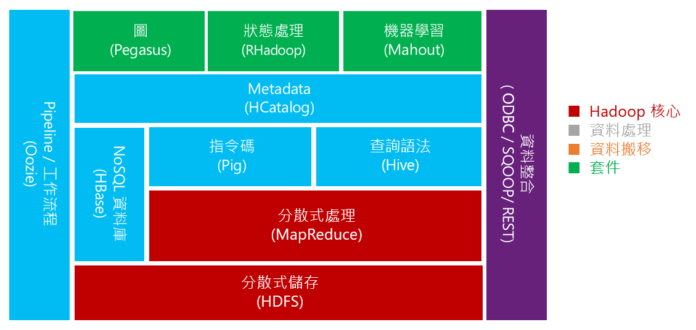
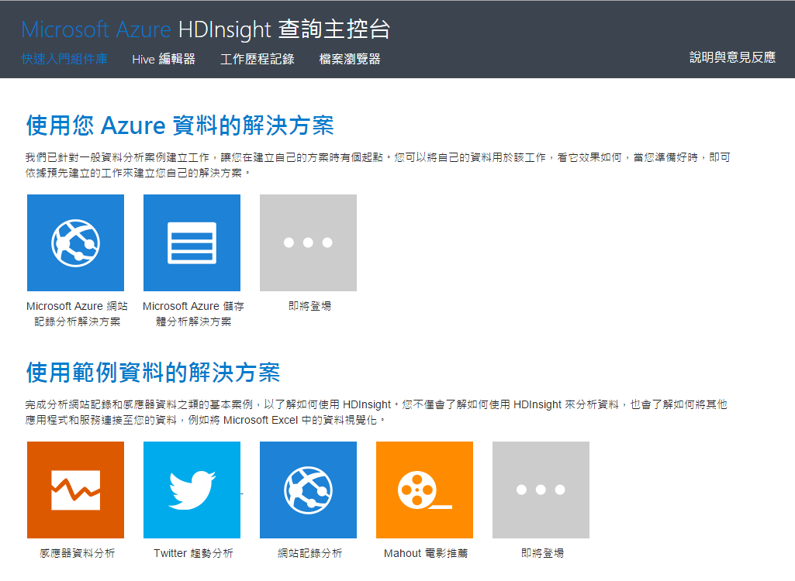
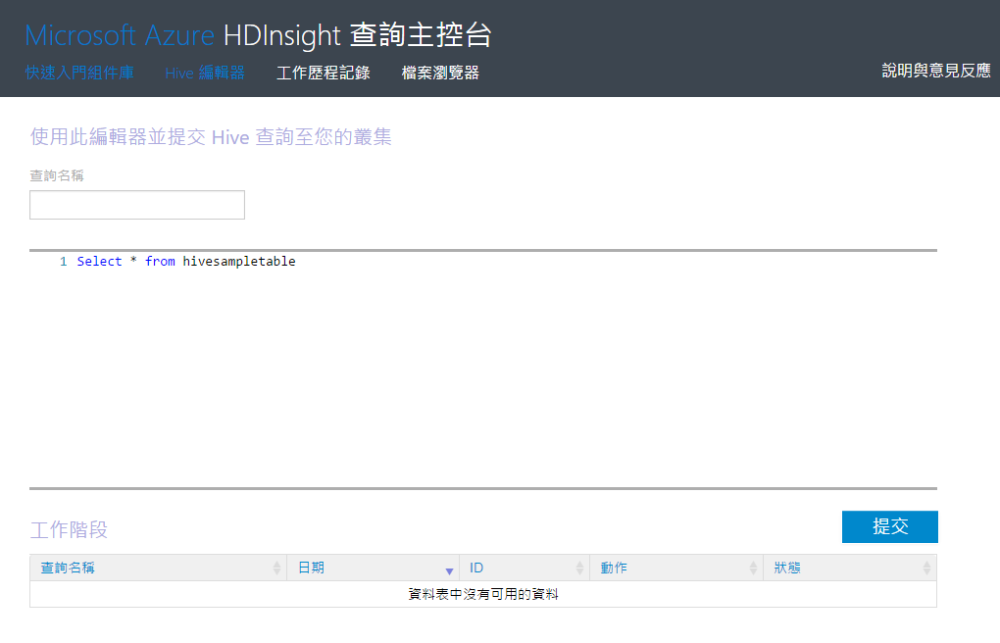
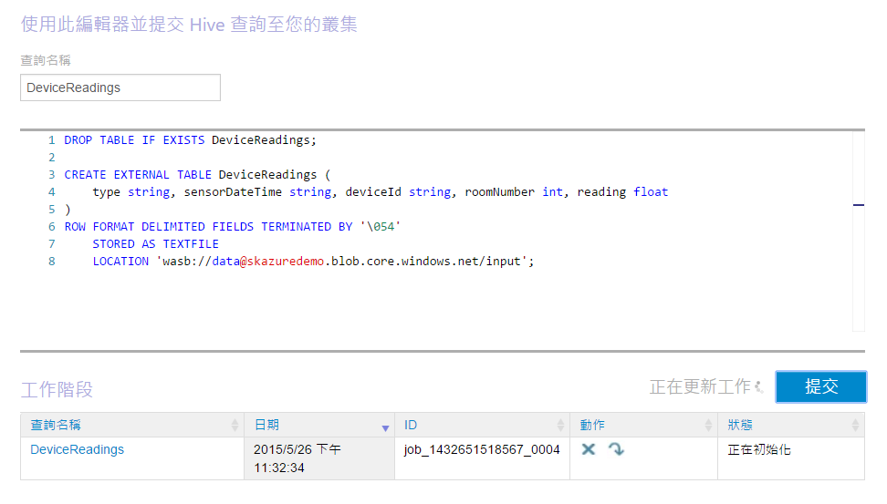
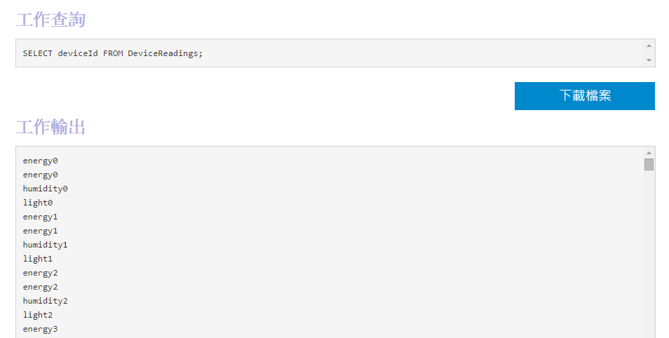
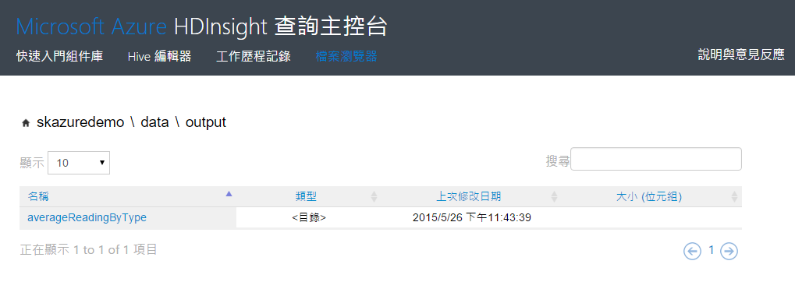

# Hands on Lab 3 - 使用 Azure HDInsight #

操作時間: **60 分鐘**

事前準備：

  1. **擁有 Microsoft Azure 的訂閱帳戶並且能夠開通服務**。
  2. 完成:
    * [Hands-on Lab 1 - 使用 Azure Event Hubs](HOL1-EventHubs.md)
    * [Hands on Lab 2 - 使用 Azure Stream Analytics](HOL2-StreamAnalytics.md)

目標完成：

  * 使用 Hive 建立資料表。

# 1. Azure HDInsight #

## Apache Hadoop 專案 ##

[Apache Hadoop](http://hadoop.apache.org/) 是基於 MapReduce 技術，特別用來操作或儲存海量資料所開發的一個開源專案，除了可以用分散式的運算模型來平行化處理複雜的運算之外，它的架構設計上也大大降低了資料延展的複雜度。



而除了儲存及操作海量資料外，因為很多人有不同操作資料的動機及需求，於是基於 Hadoop 專案也衍生了許多不同的專案，也造就了一個 Hadoop 的生態系。

## Azure HDInsight ##

Azure HDInsight 是 Microsoft Azure 與 Horton Networks 公司合作將 Apache Hadoop 專案移植到 Microsoft Azure 上的服務名稱，這意味著使用 Azure HDInsight 就跟操作 Hadoop 是一模一樣的，除了既有基於 Hadoop 開發出來的工具（如：[Hive](https://hive.apache.org/), [Pig](https://pig.apache.org/) 等）可以沿用、Azure HDInsight 還加入了一些關於 .NET、ODBC 驅動程式等擴充支援性，還不用自己架設及管理 Hadoop 的運算叢集，直接在 Microsoft Azure 上建立服務，並根據需要及負擔的價格來選擇運算資源的多寡。而在 Azure HDInsight 上的 Hadoop 版本已經可以直接處理放在 Azure BLOB 儲存體的資料，十分方便。


# 2. 建立 Azure HDInsight 服務 #

操作時間: **10 分鐘**

1.  在 [Microsoft Azure 的管理後台](https://manage.windowsazure.com/)，點擊左下角的_「+ 新增」_，選擇_「資料服務」_ » _「HDINSIGHT」_ » _「HADOOP」_，接著設定**名稱**（用來連結叢集）、**叢集大小**、連結 HDInsight 的**帳號密碼**、以及使用的**儲存體**。

    

		上述的步驟是建立以 Windows Server 為基礎的 Hadoop 環境，您也可以選擇「LINUX 上的 HADOOP」來建立以 (Ubuntu) Linux 為基礎的 Hadoop 環境。

2. 根據選擇的叢集大小需要一點時間建立服務，建立完成後，就可以直接將需要 Hadoop 執行的工作丟上這個服務上執行（Windows Server 為基礎的 Hadoop 用 PowerShell 來遞交工作；Linux 為基礎的 Hadoop 則用 SSH 來遞交）。

	

# 3. 建立 Hive 查詢表 #

操作時間: **30 分鐘**

## Hive 簡介

[Apache Hive](https://hive.apache.org/) 是基於 Apache Hadoop 專案所發展的一個查詢語法開源專案，透過 Hive 可以使用類似 SQL 的語法，稱為 _HiveQL_，可將儲存在 Hadoop 中的非結構化資料建立出具有結構的資料表（table），而這個 HiveQL 的查詢語句也是由 Hadoop 中的 MapReduce 基礎來執行，所以也很適合用來處理巨量資料。

接下來我們會以 HiveQL 的操作來建立 Hive 資料表。

## 上傳資料

為了完成後續的操作，首先要放一些檔案在 Azure Blob 儲存體中讓 Azure HDInsight 來讀取操作。

1.  下載並安裝 [AzCopy](http://aka.ms/downloadazcopy) 工具方便讓我們把檔案上傳至 Azure HDInsight 對應的 Blob 儲存體。

2.  下載範例檔案 [data.csv](../data/data.csv)，這是一個模擬 IoT 裝置送到儲存體中的資料，裡面包含像是感測器測到的溫度、溼度、能源、光線等數值的資料（約 6 萬筆資料）。

3.  打開**命令提示字元**，切換目錄到 _C:\Program Files (x86)\Microsoft SDKs\Azure\AzCopy_，執行下列指令，其中要將 Azure Blob 儲存體的帳號名稱、存取金鑰以及 data.csv 檔案的路徑換成你建立的資料。**別忘了先在儲存體帳戶下建立一個 _data_ 的容器**。

		AzCopy /Source:"data.csv目錄" /Pattern:data.csv /Dest:https://儲存體帳號名稱.blob.core.windows.net/data/input /DestKey:儲存體存取金鑰

## 使用 Web 主控台來操作 Hive 查詢

1.  在建好的 Azure HDInsight 管理後台中，可以按下下方工作列的**查詢主控台（QUERY CONSOLE）**來進入由 Azure HDInsight 準備的一個 Web 操作介面來執行 Hive 查詢。

		如果是建立 Hadoop on Linux 的 HDInsight 服務，那會是透過 AMBARI WEB 操作介面。

    

2.  跳出帳號密碼對話盒時，輸入在建立 HDInsight 服務時所設定的管理者帳號及密碼，就會登入這個查詢主控台的頁面，左下方的下拉式選單可以切換介面語言。

    

3.  你可以在查詢主控台中看到一些範例、工作歷史記錄、或是瀏覽儲存體內的檔案，也可以使用 **Hive 編輯器** 來執行 Hive 查詢語句。

    

## 建立 Hive 查詢表

### 建立 DeviceReadings 資料表

1.  在 Hive 編輯器中，輸入下列語法先建立一個 EXTERNAL 的 Hive 資料表，而資料輸入的 Blob 儲存體位址也要換成您所建立的 URL（URL中的 ```data``` 就是容器名稱）。修改完畢後，可以將這個查詢名稱定為 **DeviceReadings** 方便查詢工作記錄，然後再按下右下角的**提交**按鈕送出工作給 Azure HDInsight 來執行。

	```SQL
	DROP TABLE IF EXISTS DeviceReadings;
	
	CREATE EXTERNAL TABLE DeviceReadings (
	    type string, sensorDateTime string, deviceId string, roomNumber int, reading float
	)
	ROW FORMAT DELIMITED FIELDS TERMINATED BY '\054'
	    STORED AS TEXTFILE
	    LOCATION 'wasb://data@儲存體帳戶名稱.blob.core.windows.net/input';
	```

2.  按下提交後，可以在下方的工作階段中看到這個查詢工作執行的狀況：

    

    也可以利用上方的**工作歷程記錄**來觀看執行過的工作。

3.  當工作結束後，你可以執行一個新的查詢工作：

	```SQL
	SELECT deviceId FROM DeviceReadings;
	```

    再送出這個查詢工作確認是否正確建立了 **DeviceReadings** 的 Hive 資料表，如果有正確地列出來欄位的資料，就表示資料表已成功建立了。

    


### 建立 AverageReadingByDeviceType 資料表

1.  如果成功建立了 DeviceReadings 的資料表，那接下來就可以根據 DeviceReadings 這個資料表來建立 AverageReadingByDeviceType 資料表，一樣要修改儲存體帳號的位置，而這個資料表的內容就會儲存在儲存體的 data/output 下。

	```SQL
	DROP TABLE IF EXISTS AverageReadingByType;
	
	CREATE EXTERNAL TABLE AverageReadingByType (type string, reading float)
	    row format delimited 
	    fields terminated by '\t' 
	    lines terminated by '\n' 
	    stored as textfile location 'wasb://data@<storage account name>.blob.core.windows.net/output/averageReadingByType';
	
	
	INSERT INTO TABLE AverageReadingByType SELECT TYPE, avg(reading) 
	    FROM DeviceReadings  
	    GROUP BY TYPE;
	```

2.  如果這個查詢順利執行完成後，可以利用查詢主控台的檔案瀏覽器看一下它產生的檔案。

	


### 建立 AverageReadingByMinute 資料表

1.  如同前述的方式，再執行下列查詢工作來產生 AverageReadingByMinute 資料表：

	```SQL
	DROP TABLE IF EXISTS AverageReadingByMinute;
	
	CREATE EXTERNAL TABLE AverageReadingByMinute (type string, sensorDateTime string, roomNumber int, reading float)
	   row format delimited 
	   fields terminated by '\t' 
	   lines terminated by '\n' 
	   stored as textfile location 'wasb://data@<storage account name>.blob.core.windows.net/output/averageReadingByMinute';
	
	INSERT INTO TABLE AverageReadingByMinute SELECT TYPE,  concat(substr(sensorDateTime, 1, 16), ":00.0000000Z"), roomNumber, avg(reading) 
	   FROM DeviceReadings 
	   WHERE roomNumber IS NOT NULL 
	   GROUP BY TYPE, concat(substr(sensorDateTime, 1, 16), ":00.0000000Z"), roomNumber;
	```

### 建立 MaximumReading 資料表

1.  執行下列 Hive 查詢工作：

	```SQL
	DROP TABLE IF EXISTS MaximumReading;
	
	CREATE EXTERNAL TABLE MaximumReading (type string, sensorDateTime string, roomNumber int, maxReading float)
	   row format delimited 
	   fields terminated by '\t' 
	   lines terminated by '\n' 
	   stored as textfile location 'wasb://data@<storage account name>.blob.core.windows.net/output/maximumReading';
	
	INSERT INTO TABLE MaximumReading 
	SELECT mr.type, min(mr.sensorDateTime), min(mr.roomNumber), mr.reading FROM (
	   SELECT a.type, a.sensorDateTime, a.roomNumber, a.reading from DeviceReadings a
	   JOIN (SELECT type, max(reading) reading FROM DeviceReadings GROUP BY type ) b
	   ON (a.type = b.type and a.reading = b.reading) 
	) mr 
	GROUP BY mr.type, mr.reading;
	```

### 建立 MinumumReading 資料表

1.  執行下列 Hive 查詢工作：

	```SQL
	DROP TABLE IF EXISTS MinimumReading;
	
	CREATE EXTERNAL TABLE MinimumReading (type string, sensorDateTime string, roomNumber int, maxReading float)
	    row format delimited 
	    fields terminated by '\t' 
	    lines terminated by '\n' 
	    stored as textfile location 'wasb://data@<storage account name>.blob.core.windows.net/output/minimumReading';
	
	INSERT INTO TABLE MinimumReading 
	SELECT mr.type, min(mr.sensorDateTime), min(mr.roomNumber), mr.reading FROM (
	    SELECT a.type, a.sensorDateTime, a.roomNumber, a.reading from DeviceReadings a
	    JOIN (SELECT type, min(reading) reading FROM DeviceReadings GROUP BY type ) b
	    ON (a.type = b.type and a.reading = b.reading) 
	) mr 
	GROUP BY mr.type,  mr.reading;
	```

# 4. 刪除 Hadoop 叢集

如果 lab 做完了，資料表也都儲存在 Azure Blob 儲存體中了，那 Azure HDInsight 的服務就可以先刪除，以免沒有使用到了還持續在提供服務，那帳單就會持續累積這些服務的使用費喔。

# 5. 整合 Excel 中的 Power Query 做資料視覺化

TBW