# Hands on Lab 5 - 使用 Azure 機器學習 #

所需時間: **30 分鐘**

事前準備: **擁有 Microsoft Azure 的訂閱帳戶並且能夠開通服務**。

# 1. 建立 Azure 機器學習工作區 #

所需時間: **2 分鐘**

在 [Microsoft Azure 的管理後台](https://manage.windowsazure.com/)，點擊左下角的_「+ 新增」_，選擇_「資料服務」_ » _「機器學習」_ ，選擇**快速建立**，然後填入**工作區名稱**、**擁有者**以及**儲存體帳戶**。儲存體帳戶在這裡是用來儲存機器學習時所需要或儲存後的資料。

	目前 Azure 機器學習僅部署在美國中南部機房

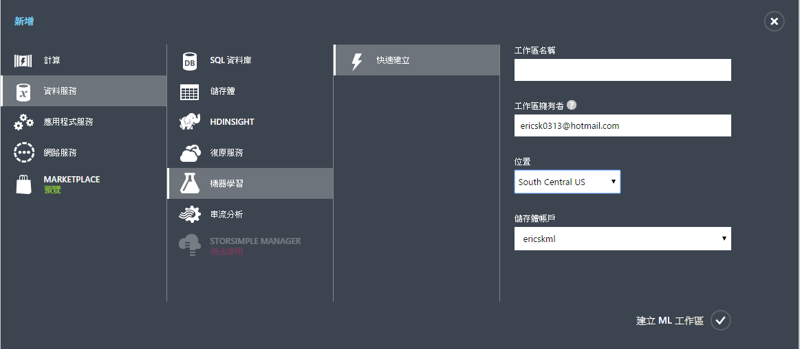  

最後按下右下角的**建立 ML 工作區**完成建立。

# 2. 進入 ML Studio #

所需時間: **2 分鐘**

建立好 Azure 機器學習工作區後，就可以在管理後台中，進入剛才建立的機器學習工作區，然後按照連結進入 ML Studio 中進行機器學習的操作。

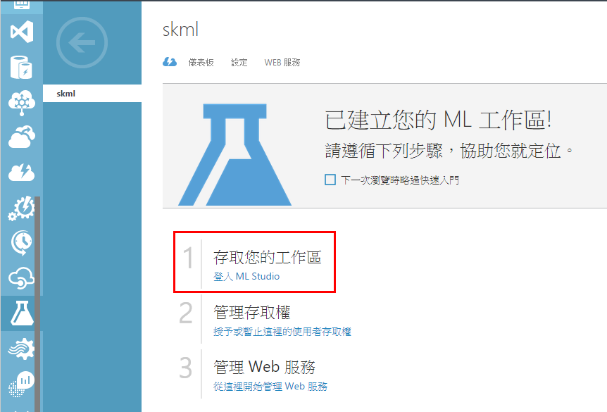

# 3. 在 ML Studio 中建立實驗 #

所需時間: **20 分鐘**

1.  進入 ML Studio 後，按左下角的_「+ NEW」_，然後點擊 **Blank Experiment** 來建立一個全新的實驗。

    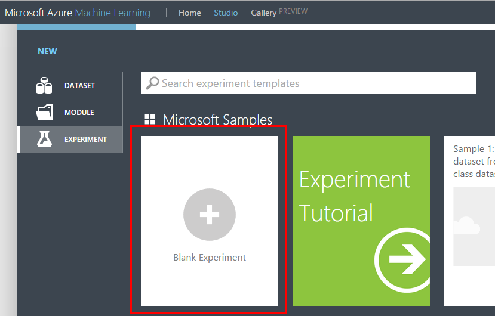

2.  進入實驗室的畫面後，在標題的部份改為_「汽車價格銷售預測模型」_，用來表示等一下做的實驗是什麼。

    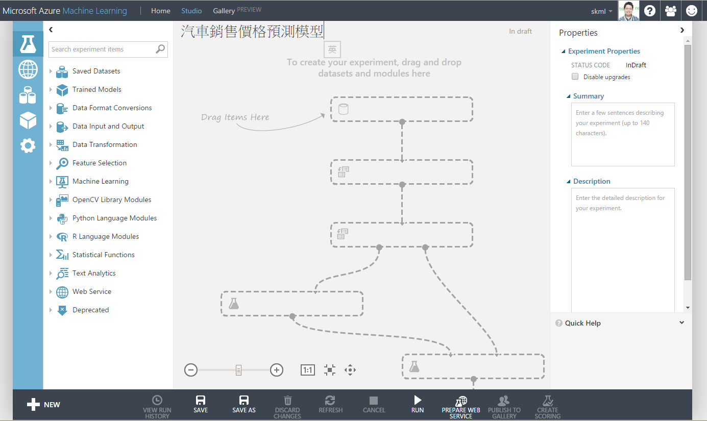

3.  從左側的面板中，於 **Saved Datasets**  » **Samples** 裡拖拉出 **Automobile price data (RAW)** 的區塊到實驗室區域中。

    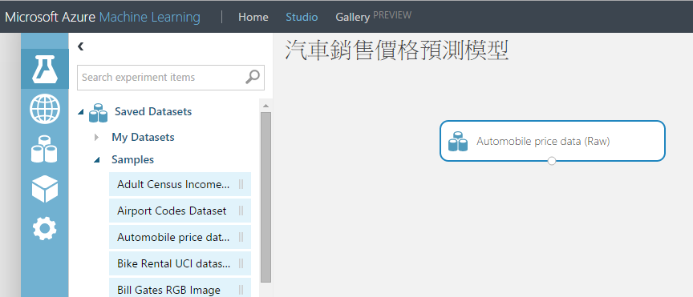

4.  在 Azure ML Studio 的實驗室中，你隨時可以在區域的輸出節點中按右鍵選擇 **Download** 或是 **Visualize** 來觀看資料的內容。

    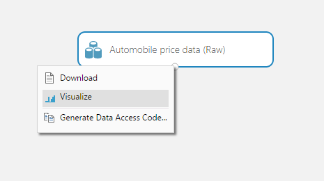

    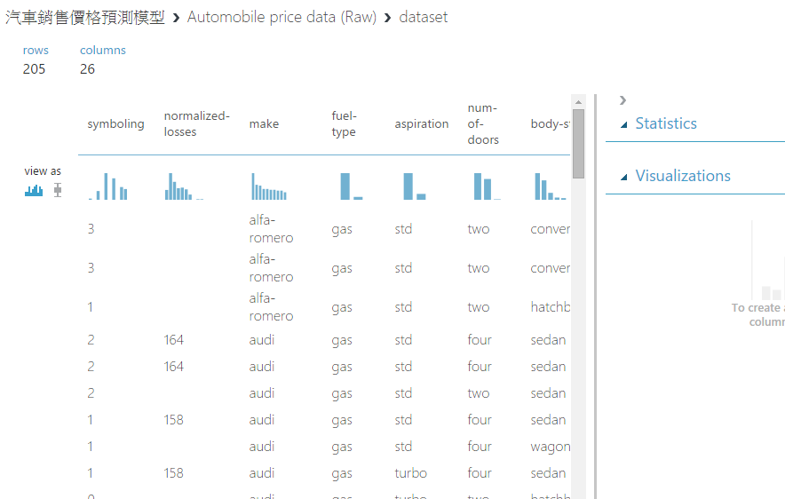

5.  再從左側面板中，於 **Data Transformation** » **Manipulation** 中拖拉出 **Project Columns** 到實驗室區域中，並且把資料流接到這個區塊上，這樣就可以對資料進行一些操作。

    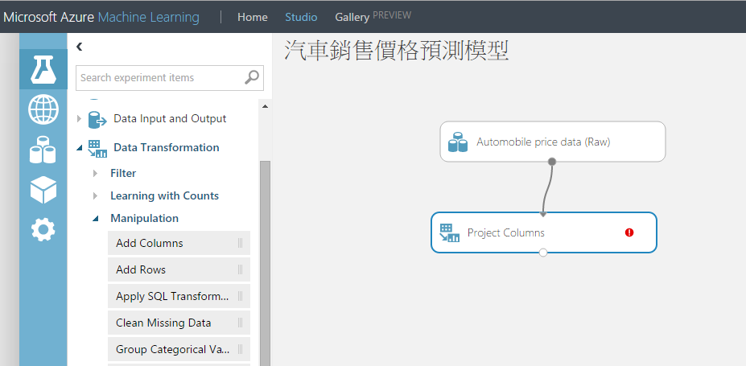

6.  在選擇的焦點在 Project Columns 區塊上，然後按下右側面板的 **Launch column selector** ，在跳出的對話盒中選擇 _Begin With All columns_ 然後下方是 _Exclude column names normalized-losses_，這樣一來資料經過這個區域後就會移除 _normalized losses_ 這個欄位的資料。

    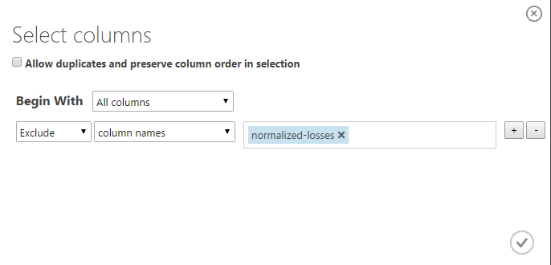

7.  完成後，再從左側面板中的 **Data Transformation** » **Manipulation** 中拖拉出 **Cleaning Missing Data**，然後在右側面板中的 **Cleaning mode** 選擇 _Remove entire row_，再把資料流接起來，這樣便會移除資料中有欄位缺漏的資料。

    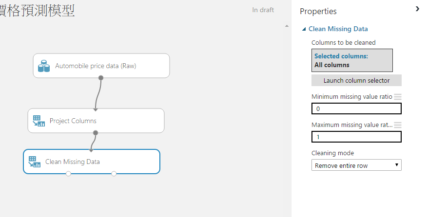

8.  此時再拉出一個 **Project Columns** 的區塊，這次我們要把準備拿來訓練模型的欄位留下來，所以按下 **Launch column selector** 後，選擇 _Begin With No columns_ 然後 _Include column names make, body-style, wheel-base, engine-size, horsepower, peak-rpm, highway-mpg, price_ 並且再把資料流接起來。

    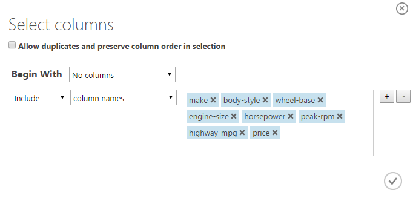

9.  在準備開始訓練模型之前，我們要先把資料區分成兩部份，一部份用來做模型的訓練，而另一部份來驗證模型的準確度，所以從左側面板的 **Data Transformation** » **Sample and Split** 中拖拉出 **Split** 的區塊，接到資料流中，而這裡也可以利用右側的面板來決定資料要怎麼切割，在 **Fraction of rows ...** 的欄位中可以選擇 0 ~ 1 之間的數值，用來表示左側的輸出佔有多少比例（如：0.8 表示左側輸出 80% 的資料，右側則是 20%）。

    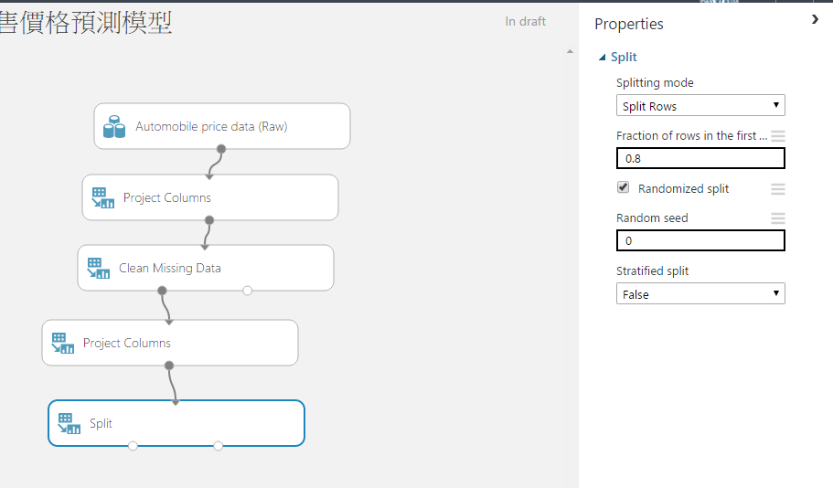

10. 拉下來要開始訓練模型，首先在左側面板中的 **Machine Learning** » **Train** 中拉出 **Train Model** 的區塊，並且把分割後的資料接上右側的輸入節點，由於我們建立出來的模型是要能預測價格，所以在 Train Model 中要選擇 _price_ 這個欄位。

    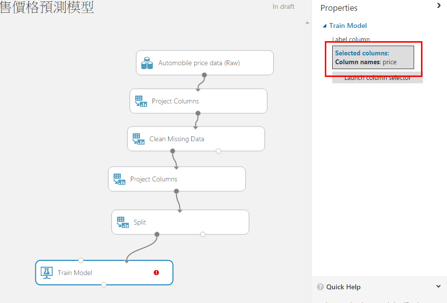

11. Train Model 的另一個輸入則是演算法，由於_汽車銷售價格預測模型_是一個**預測**的學習，所以這裡我們採用 _Regression_ 類的演算法來做訓練，從左側的面板中 **Machine Learning** » **Initialize Model** » **Regression** 中拖拉出 **Linear Regression** 的區塊，並接上 Train Model。

    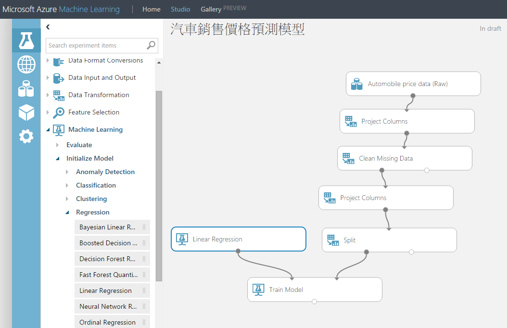

12. 訓練好的模型，我們要驗證一下這個模型的準確度，這裡可以從左側面板中 **Machine Learning** » **Score** 拉出 **Score Model**，並接上訓練好的模型以及分割用來做驗證的資料。Score Model 這裡就會使用訓練好的模型來預測輸入資料的價格。

    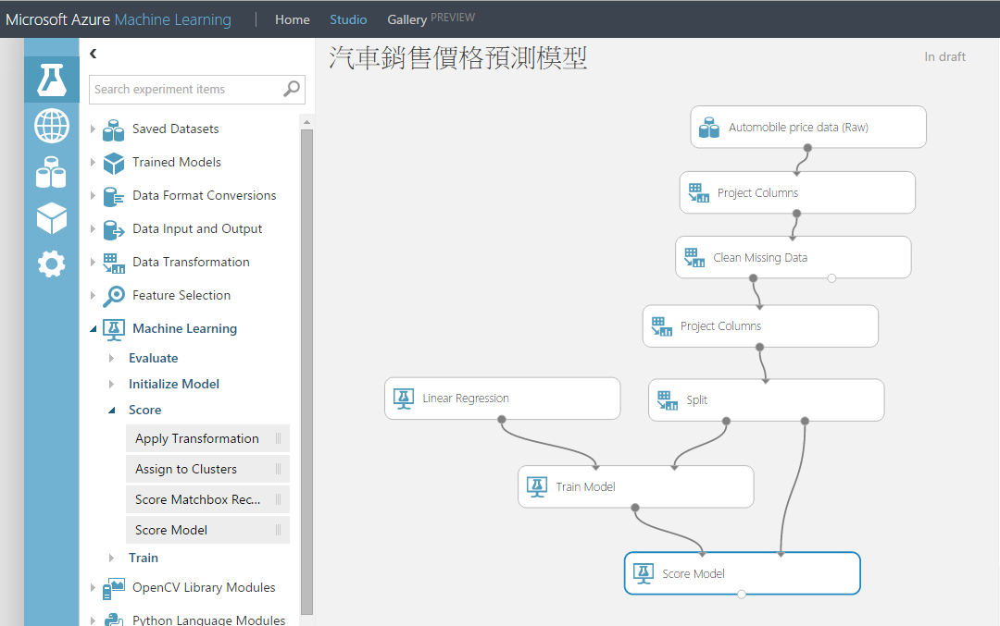

13. 最後，可以再使用 **Machine Learning** » **Evaluate** 中的 **Evaluate Model** 來分析及評估由 Score Model 做完的結果。

    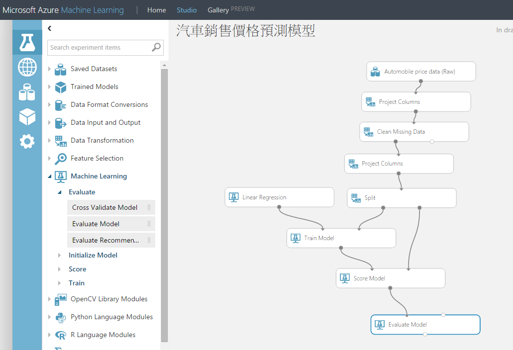

14. 拖拉完畢，檢查這些區塊中是否有未完成的動作（看區塊中是否有紅色驚歎號），接著就能按下下方工作列的 **Run** 來實際執行一次機器學習的實驗。執行完成後，可以在 **Evaluate Model** 的輸出中按下 **Visualize** 來瀏覽這次實驗中訓練的模型準確度。

    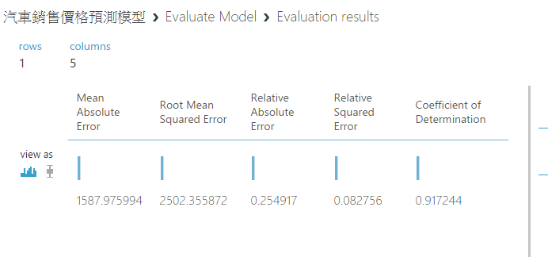

15. 到這裡已經完成了一次機器學習的操作，你可以試著替換不同的學習演算法（如將 _Linear Regression_ 換成其它的 Regression 演算法），或是分割資料時改變一些參數，重新再執行一次實驗，看看訓練出來的模型準確度如何。

# 4. 將訓練模型發佈成 Web Service #

所需時間：**6 分鐘**

1.  在 ML Studio 的實驗室中，在實驗已經跑完的狀態下，從左側面板的 **Web Service** 中拉出 **Input** 及 **Output** 的區塊，然後將 **Input** 接在 _Score Model_ 的右側資料輸入的位置，然後 **Output** 接在 _Score Model_ 的輸出位置。

    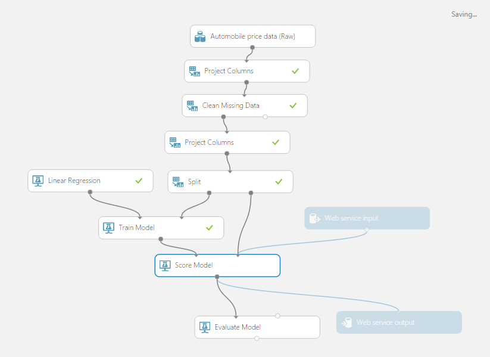

2.  接好 Web Service 的 Input 及 Output 之後，重新跑一次實驗，然後再按下下方工作列的 **PUBLISH WEB SERVICE** 按鈕將這個訓練好的模型做成 web service。

    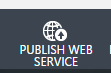

3.  發佈完成後就有一個 API 的說明頁面，包含了 **API Key** 以及測試 API 的小工具或 Excel Workbook。

    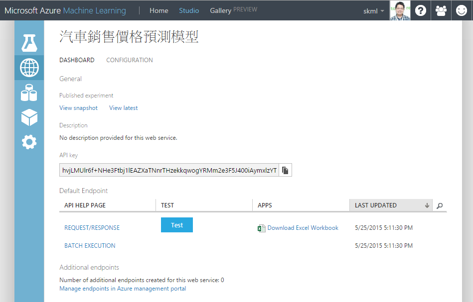

4.  按下 **Test** 按鈕，可以輸入一些測試資料來看看這個模型能預測出什麼價格，比方說可以輸入 toyota,hatchback,102.4,122,92,4200,32 看看它預測出來的價格離 11248 多遠。

    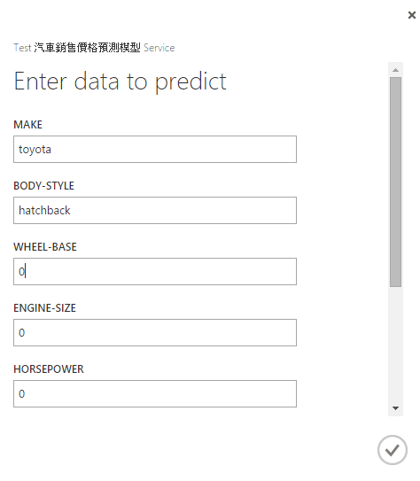

5.  按下 **REQUEST/RESPONSE** 的連結就會導向詳細的 API 說明頁面，包含呼叫的網址、參數以及範例程式碼，透過這一頁的說明，就可以很容易地將訓練好的模型透過 Web Service 的方式整合。

    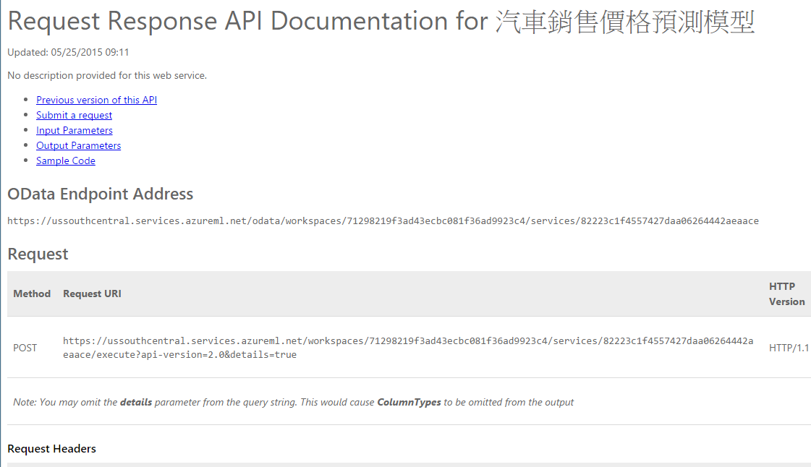